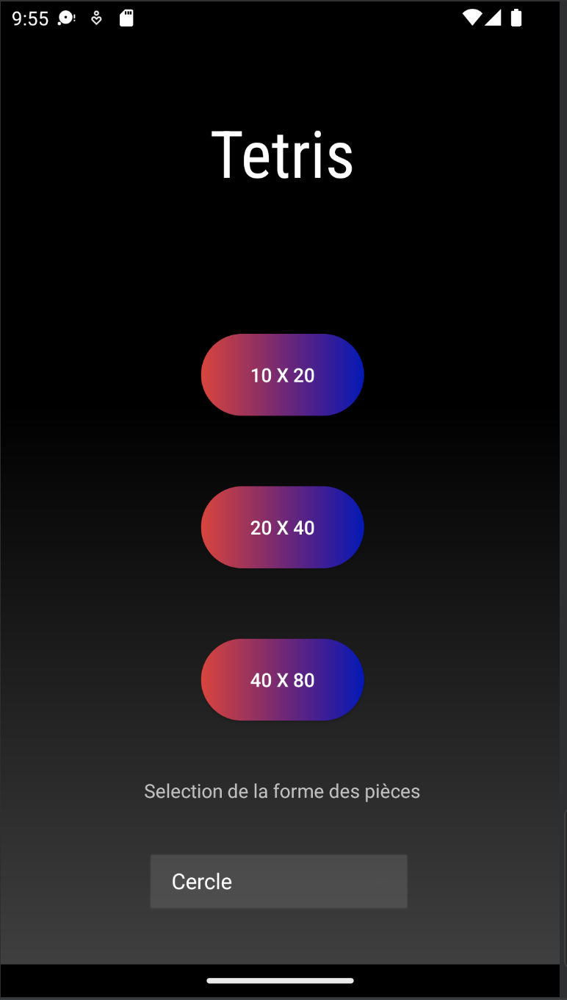
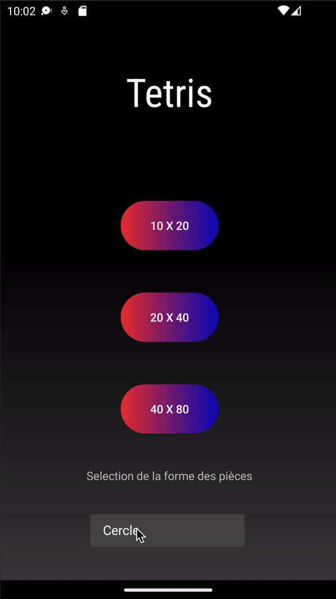

# Tetris

### Auteurs : Nabyl Quignon, Mugilan Ragavan
---

## 1. Comment jouer ?
---

    

 - On selectionne la forme de pièce avec laquelle on souhaite jouer entre : Cercle, Losange, Carré, Pentagone, Etoile 1 et Etoile 2.

 - On clique ensuite sur la taille de grille souhaité parmis : 10 x 20, 20 x 40 et 40 x 80.

    

 - Pour decaler la pièce vers la gauche/droite, on swipe vers le coté voulu.

 - Pour faire tourner la pièce on clique sur l'écran.

 - Une ligne cassé fait remporter 1000 points.

 - On gagne la partie si la grille est vide et on perd lorsque les pièces sont bloqué sur le haut de la grille.

 ## 2. Code
---
 Chaque partie du jeu se situe dans son dossier respectif : 
 - "Activities" pour les activités Android.
 - "Formes" qui contient les différentes formes qui implémentent l'interface "Forme", elles contiennent leur liste de coordonnées, leurs indices et leurs couleurs.
 - "Game" qui contient la boucle de jeu qui fonctionne avec des Threads dans le fichier Game. Il contient aussi le Renderer et le SurfaceView du jeu.
 - "Preview" qui contient le renderer et le SurfaceView de la preview.
 - "Logique" qui contient la logique du jeu, c'est-à-dire la grille qui est un tableau à 2 dimensions avec une grille "statique" avec les pièces qui sont deja tombé et une grille "dynamique" avec la pièce qui tombe dans la grille.
 - La classe Batch elle contient la méthode draw de manière optimisé, en effet le jeu était extremement lent lorsque qu'on faisait appel a 1 draw par carré, cette classe se charge juste de reunir toutes formes à dessiner et de ne faire qu'un seul appel a la methode "*glDrawElements*". On passe de 100 ms de temps de rendu a 4 ms grâce a cette méthode.

